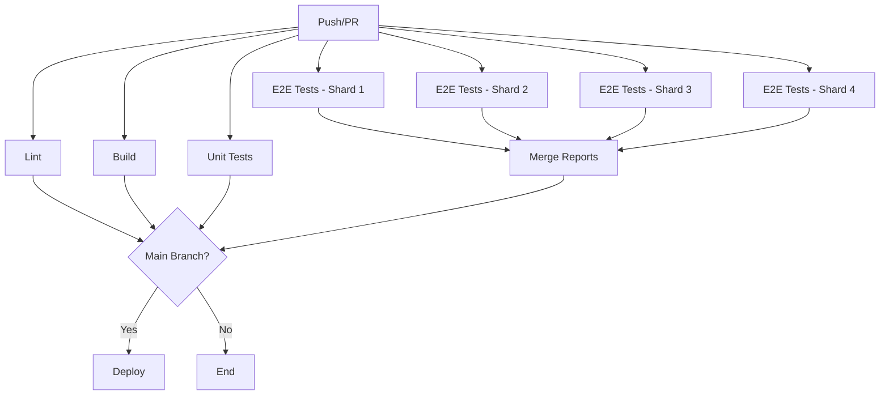

# CI/CD Pipeline

teXt0wnz uses GitHub Actions for continuous integration, testing, and deployment. The pipeline ensures code quality, runs comprehensive tests, and automatically deploys to GitHub Pages.

## Overview

The CI/CD system consists of 10 workflow files that handle:

- Code quality checks (linting, formatting)
- Automated testing (unit, DOM, E2E)
- Build verification
- Docker image creation
- Deployment to GitHub Pages
- Wiki documentation synchronization

## Workflow Architecture

```
┌─────────────────────────────────────────────────────────────┐
│                      test-suite.yml                         │
│                    (Main Orchestrator)                      │
└──────────┬──────────────────────────────────────────────────┘
           │
           ├──> lint.yml          (Code Quality)
           ├──> build.yml         (Build Verification)
           ├──> unit.yml          (Unit Tests)
           ├──> e2e.yml           (E2E Tests - Sharded)
           ├──> merge-reports.yml (Merge E2E Results)
           └──> deploy.yml        (GitHub Pages Deploy)

┌────────────────────────────────────────────────────────────┐
│                  docker-build.yml                          │
│              (Container Image Builder)                     │
└────────────────────────────────────────────────────────────┘

┌────────────────────────────────────────────────────────────┐
│                ci-docker-build.yml                         │
│            (CI Container Image Builder)                    │
└────────────────────────────────────────────────────────────┘

┌────────────────────────────────────────────────────────────┐
│                      wiki.yml                              │
│              (Documentation Publisher)                     │
└────────────────────────────────────────────────────────────┘
```

## Core Workflows

### 1. test-suite.yml (Main Pipeline)

**Purpose:** Orchestrates the complete CI/CD pipeline for code changes.

**Triggers:**

- Push to `main` branch (excluding docs and markdown files)
- Pull requests to any branch
- Manual workflow dispatch

**Jobs:**

1. **lint** - Code quality checks
2. **build** - Build verification
3. **unit** - Unit test execution
4. **e2e** - End-to-end tests (4-way sharded for speed)
5. **reports** - Merge E2E test reports
6. **deploy** - Deploy to GitHub Pages (main branch only)

**Path Ignores:**

- `docs/**`
- `**/*.md`
- `LICENSE.txt`
- `OSSMETADATA`
- `.gitattributes`
- `.gitignore`
- `.prettierignore`

**Permissions:**

```yaml
contents: write
pages: write
id-token: write
packages: read
```

**Workflow:**



### 2. lint.yml

**Purpose:** Validates code style and quality using ESLint.

**Called by:** test-suite.yml

**Steps:**

1. Checkout code
2. Setup Bun
3. Install dependencies
4. Run `bun lint:check`

**Coverage:**

- HTML files (`src/**/*.html`)
- JavaScript files (`src/js/**/*.js`)
- Test files (`tests/**/*.js`)

**Linting Rules:**

- ESLint configuration from `eslint.config.js`
- HTML linting with `@html-eslint/eslint-plugin`
- Stylistic rules with `@stylistic/eslint-plugin`

### 3. build.yml

**Purpose:** Verifies the application builds successfully and produces expected artifacts.

**Called by:** test-suite.yml

**Steps:**

1. Checkout code
2. Setup Bun
3. Install dependencies
4. Modify `.env` for GitHub Pages domain
5. Build application with `bun bake`
6. Verify build artifacts exist
7. Upload build artifacts (main branch only)

**Verified Artifacts:**

- Directory structure (`dist/ui`, `dist/ui/js`, `dist/ui/img`, `dist/ui/fonts`)
- Static files (icons, manifest, HTML, robots.txt, sitemap.xml)
- Hashed files (JavaScript bundles, CSS, SVG icons, screenshots)
- Service worker and Workbox runtime

**Artifact Upload:**

- Name: `editor-build`
- Retention: 3 days
- Only on successful builds from the `main` branch

### 4. unit.yml

**Purpose:** Executes unit tests with coverage reporting.

**Called by:** test-suite.yml

**Steps:**

1. Checkout code with full history
2. Setup Bun
3. Install dependencies
4. Run `bun test:unit` (Vitest with coverage)
5. Inject dark theme CSS into coverage report
6. Upload coverage artifacts

**Test Configuration:**

- Test runner: Vitest
- Environment: jsdom
- Coverage provider: v8
- Output: `tests/results/coverage/`

**Coverage Report:**

- HTML report with dark theme support
- Statement, branch, function, and line coverage
- Uploaded as artifact: `unit-test-results`
- Retention: 3 days

**Dark Theme Injection:**
Adds CSS for dark mode support in coverage reports:

```css
@media (prefers-color-scheme:dark) { ... }
```

### 5. e2e.yml

**Purpose:** Runs end-to-end tests in real browsers using Playwright.

**Called by:** test-suite.yml (4 times with different shards)

**Sharding Strategy:**
Tests are split into 4 parallel shards for faster execution:

- Shard 1/4
- Shard 2/4
- Shard 3/4
- Shard 4/4

**Container:**

```yaml
image: ghcr.io/xero/text0wnz/ci:latest
options: --user root
```

[ci docker image](https://github.com/xero/text0wnz/pkgs/container/text0wnz%2Fci)

**Test Browsers:**

- Chrome
- Firefox
- Safari

**Steps:**

1. Checkout code
2. Install dependencies with Bun
3. Set localhost domain in `.env`
4. Build application
5. Run E2E tests for assigned shard
6. Upload blob report

**Environment:**

- `HOME: /root`
- `PLAYWRIGHT_TEST_BASE_URL: http://localhost:8060`

**Artifacts:**

- Name: `blob-report-{shard}` (e.g., `blob-report-1-4`)
- Path: `blob-report`
- Retention: 1 day
- Always uploaded (even on failure)

### 6. merge-reports.yml

**Purpose:** Combines Playwright reports from all E2E shards into a single HTML report.

**Called by:** test-suite.yml

**Steps:**

1. Checkout code
2. Install Bun and Playwright
3. Download all blob reports
4. Merge reports with `playwright merge-reports --reporter html`
5. Upload merged report

**Input:**

- Downloads artifacts matching pattern: `blob-report-*`
- Merges multiple blob reports into one

**Output:**

- Artifact name: `merged-playwright-report`
- Path: `playwright-report`
- Retention: 14 days (configurable)

### 7. deploy.yml

**Purpose:** Deploys the application and test reports to GitHub Pages.

**Called by:** test-suite.yml (only on main branch)

**Permissions:**

```yaml
contents: read
pages: write
id-token: write
```

**Concurrency:**

- Group: `pages`
- Cancel in-progress: false

**Jobs:**

#### build-artifacts

1. Download `editor-build` artifact
2. Download `unit-test-results` artifact
3. Download `merged-playwright-report` artifact
4. Organize files:
   ```
   release/
   ├── (application files)
   └── tests/
       ├── (unit coverage)
       └── e2e/
           └── (E2E report)
   ```
5. Upload pages artifact

#### deploy

1. Deploy to GitHub Pages using pages artifact
2. Set environment: `github-pages`
3. Output deployment URL

**Deployed Structure:**

```
https://xero.github.io/text0wnz/
├── index.html              (Application)
├── ui/                     (Assets)
└── tests/
    ├── index.html          (Unit coverage)
    └── e2e/
        └── index.html      (E2E report)
```

## Docker Workflows

### 8. docker-build.yml

**Purpose:** Builds and publishes multi-architecture Docker images for the Editor.

**Triggers:**

- Manual workflow dispatch
- Push to main when `Dockerfile` changes

**Platforms:**

- `linux/amd64`
- `linux/arm64`

**Registries:**

1. GitHub Container Registry: `ghcr.io/xero/text0wnz`
2. Docker Hub: `xerostyle/text0wnz`

**Steps:**

1. Checkout code
2. Setup QEMU for multi-arch builds
3. Setup Docker Buildx
4. Login to GitHub Container Registry
5. Login to Docker Hub
6. Extract metadata
7. Build and push images

**Tags:**

- `latest` (always)
- `sha-{short-sha}` (commit-based)

**Cache:**

- Type: GitHub Actions cache
- Mode: max (cache everything possible)

### 9. ci-docker-build.yml

**Purpose:** Builds the CI container image used for E2E testing.

**Triggers:**

- Manual workflow dispatch
- Push to main when `.github/ci.Dockerfile` changes

**Base Image:**

```dockerfile
FROM mcr.microsoft.com/playwright:latest
```

**Includes:**

- Bun runtime
- Playwright with all browsers (Chrome, Firefox, WebKit)
- ESLint and Prettier
- All necessary dependencies

**Registry:**

- `ghcr.io/xero/text0wnz/ci:latest`

**Purpose:**
Provides a pre-configured environment for E2E tests with all browsers and dependencies installed, reducing CI run time.

## Documentation Workflow

### 10. wiki.yml

**Purpose:** Synchronizes documentation from `/docs` to GitHub Wiki.

**Triggers:**

- Push to main branch with changes in `docs/**`
- Manual workflow dispatch

**Steps:**

1. Checkout repository
2. Checkout wiki repository
3. Configure git with commit author
4. Clear wiki (except `.git` and `img` folders)
5. Copy docs to wiki
6. Rename `README.md` to `Home.md`
7. Update footer with copyright year
8. Fix internal markdown links (remove `.md` extension)
9. Commit and push if changes exist

**Link Transformation:**

```perl
# Before: [link](document.md)
# After:  [link](document)
# Before: [link](document.md#section)
# After:  [link](document#section)
```

**Authentication:**
Uses `CICD_TOKEN` secret for wiki repository access.

## Security

### Pinned Actions

All GitHub Actions use commit SHAs for security:

```yaml
actions/checkout@08eba0b27e820071cde6df949e0beb9ba4906955 # v4
oven-sh/setup-bun@735343b667d3e6f658f44d0eca948eb6282f2b76 # v2
actions/upload-artifact@ea165f8d65b6e75b540449e92b4886f43607fa02 # v4
docker/setup-qemu-action@29109295f81e9208d7d86ff1c6c12d2833863392 # v3
docker/setup-buildx-action@e468171a9de216ec08956ac3ada2f0791b6bd435 # v3
docker/login-action@5e57cd118135c172c3672efd75eb46360885c0ef # v3
docker/metadata-action@c1e51972afc2121e065aed6d45c65596fe445f3f # v5
docker/build-push-action@ca052bb54ab0790a636c9b5f226502c73d547a25 # v5
actions/download-artifact@d3f86a106a0bac45b974a628896c90dbdf5c8093 # v4
actions/upload-pages-artifact@7b1f4a764d45c48632c6b24a0339c27f5614fb0b # v4
actions/deploy-pages@d6db90164ac5ed86f2b6aed7e0febac5b3c0c03e # v4
```

See: [other-tools/pin-github-action](other-tools.md#pin-github-action)

### Permissions

Each workflow uses least-privilege permissions:

**test-suite.yml:**

```yaml
permissions:
  contents: write
  pages: write
  id-token: write
  packages: read
```

**docker-build.yml:**

```yaml
permissions:
  contents: read
  packages: write
```

**deploy.yml:**

```yaml
permissions:
  contents: read
  pages: write
  id-token: write
```

### Secrets

Required repository secrets:

| Secret               | Purpose                              | Used In             |
| -------------------- | ------------------------------------ | ------------------- |
| `GITHUB_TOKEN`       | Built-in token for GitHub API access | Most workflows      |
| `DOCKERHUB_USERNAME` | Docker Hub login                     | docker-build.yml    |
| `DOCKERHUB_TOKEN`    | Docker Hub password                  | docker-build.yml    |
| `CICD_TOKEN`         | Wiki repository access               | wiki.yml            |
| `PKG_TOKEN`          | GitHub Packages access               | ci-docker-build.yml |

## Artifacts and Reports

### Build Artifacts

**editor-build**

- Content: Complete built application from `dist/`
- Size: ~10-20 MB
- Used by: deploy.yml

### Test Artifacts

**unit-test-results**

- Content: HTML coverage report from Vitest
- Path: `tests/results/coverage/`
- Includes: Dark theme CSS injection
- Used by: deploy.yml

**blob-report-{shard}**

- Content: Playwright E2E test results for one shard
- Path: `blob-report/`
- Used by: merge-reports.yml

**merged-playwright-report**

- Content: Combined E2E test HTML report
- Path: `playwright-report/`
- Used by: deploy.yml

### Download Artifacts

**Via GitHub CLI:**

```bash
# List artifacts for a run
gh run view RUN_ID --json artifacts

# Download specific artifact
gh run download RUN_ID -n editor-build
gh run download RUN_ID -n unit-test-results
gh run download RUN_ID -n merged-playwright-report
```

**Via Workflow Summary:**
Artifacts are available in the "Artifacts" section of workflow runs.

## Performance Optimization

### E2E Test Sharding

Tests are split into 4 parallel shards, reducing total test time from ~25 minutes to ~2-5 minutes:

```yaml
strategy:
  fail-fast: false
  matrix:
    shardIndex: [1, 2, 3, 4]
    shardTotal: [4]
```

### Caching

**Docker Build Cache:**

```yaml
cache-from: type=gha
cache-to: type=gha,mode=max
```

**Bun Dependencies:**
Bun's native caching handles `node_modules` efficiently.

### Conditional Execution

- Deployment only runs on main branch
- Artifact uploads skip for non-main branches
- Path filters prevent unnecessary runs

## Status Badges

The repository README includes these CI/CD badges:

```markdown
[](https://github.com/xero/teXt0wnz/actions/workflows/test-suite.yml?query=branch%3Amain)
[](https://github.com/xero/text0wnz/deployments)
[](https://github.com/xero/text0wnz/wiki)
```

## Monitoring and Debugging

### Viewing Workflow Runs

**GitHub UI:**

1. Navigate to Actions tab
2. Select workflow from sidebar
3. Click on specific run
4. View job details and logs

**GitHub CLI:**

```bash
# List recent runs
gh run list --workflow=test-suite.yml

# View run details
gh run view RUN_ID

# Watch run in real-time
gh run watch RUN_ID

# View logs
gh run view RUN_ID --log
```

### Debugging Failed Workflows

**Check Logs:**

1. Open failed workflow run
2. Click on failed job
3. Expand failed step
4. Review error messages and stack traces

**Common Issues:**

**Build Failures:**

- Check `bun bake` output
- Verify `vite.config.js` configuration
- Check for missing dependencies

**Test Failures:**

- Review test logs
- Check screenshots (E2E) in artifacts
- Verify browser compatibility

**Deployment Failures:**

- Check Pages settings in repository
- Verify permissions
- Review artifact upload/download steps

**Docker Build Failures:**

- Check Dockerfile syntax
- Verify base images are available
- Check registry authentication

### Re-running Workflows

**Via GitHub UI:**

1. Open failed workflow run
2. Click "Re-run all jobs" or "Re-run failed jobs"

**Via GitHub CLI:**

```bash
# Re-run entire workflow
gh run rerun RUN_ID

# Re-run only failed jobs
gh run rerun RUN_ID --failed
```

## Local Testing

### Running Tests Locally

**Lint:**

```bash
bun lint:check
```

**Build:**

```bash
bun bake
```

**Unit Tests:**

```bash
bun test:unit
```

**E2E Tests:**

```bash
bun test:e2e
```

### Docker Build Testing

**Standard build:**

```bash
docker buildx build -t text0wnz:local .
```

**Multi-arch build:**

```bash
docker buildx build --platform linux/amd64,linux/arm64 -t text0wnz:local .
```

**Run locally:**

```bash
docker run -p 80:80 -e NODE_ENV=development text0wnz:local
```

### CI Container Testing

**Build CI image:**

```bash
docker build -f .github/ci.Dockerfile -t text0wnz-ci:local .
```

**Run E2E tests in container:**

```bash
docker run -v $(pwd):/app -w /app text0wnz-ci:local bun test:e2e
```

## Best Practices

### Adding New Tests

1. Write tests locally first
2. Ensure tests pass locally
3. Commit and push
4. Monitor CI run
5. Fix any CI-specific issues

### Modifying Workflows

1. Test changes in a feature branch
2. Use `workflow_dispatch` for manual testing
3. Check workflow syntax with:

   ```bash
   # Install actionlint
   brew install actionlint  # macOS
   # or download from: https://github.com/rhysd/actionlint

   # Validate workflow
   actionlint .github/workflows/*.yml
   ```

4. Review security implications
5. Update documentation

### Managing Secrets

1. Use GitHub repository settings
2. Never commit secrets to code
3. Rotate secrets regularly
4. Use environment-specific secrets
5. Audit secret usage in workflows

## Continuous Improvement

### Metrics to Monitor

- Test pass rate
- Build time
- Test execution time
- Artifact sizes
- Deployment frequency
- Time to deployment

### Optimization Opportunities

1. **Reduce test time:** Further shard E2E tests if needed
2. **Improve caching:** Cache more build artifacts
3. **Parallel jobs:** Run more jobs in parallel
4. **Smaller containers:** Optimize Docker images
5. **Faster dependencies:** Keep dependencies minimal

## Related Documentation

- [Testing Guide](testing.md) - Test infrastructure details
- [Building and Developing](building-and-developing.md) - Build process
- [Docker](docker.md) - Container deployment
- [Webserver Configuration](webserver-configuration.md) - Production deployment

## Resources

- [GitHub Actions Documentation](https://docs.github.com/en/actions)
- [Docker Build Documentation](https://docs.docker.com/build/)
- [Playwright CI Documentation](https://playwright.dev/docs/ci)
- [Vitest Coverage](https://vitest.dev/guide/coverage.html)
